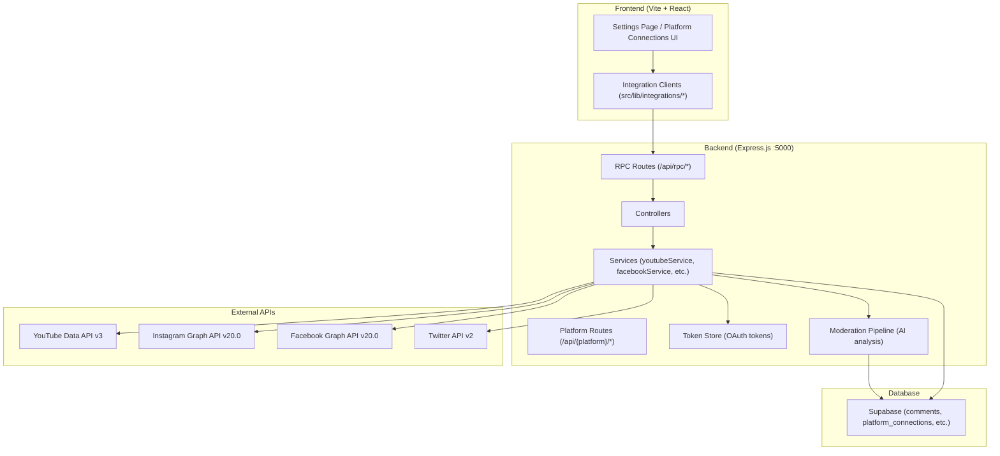
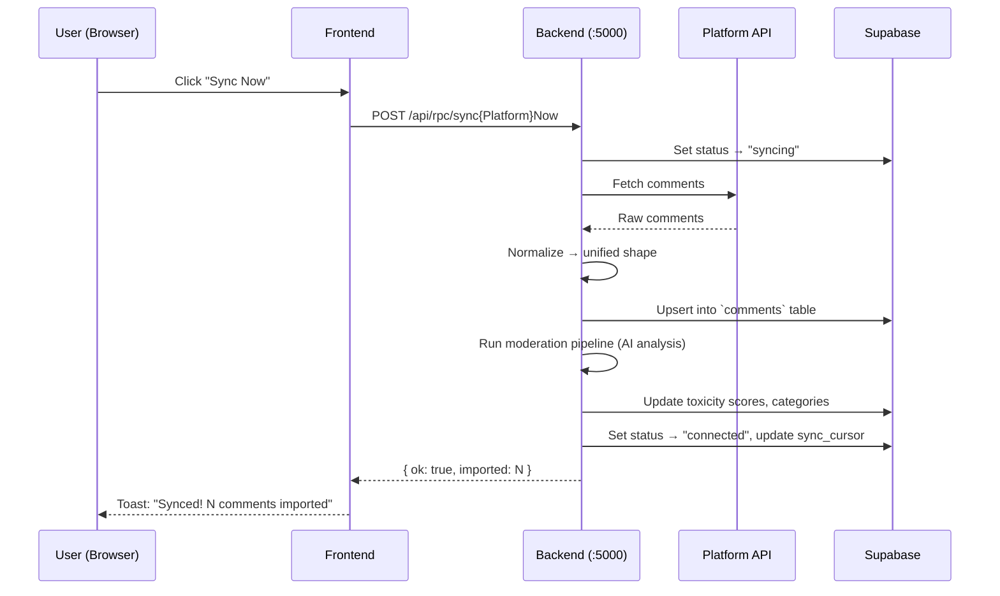

# Comment Guardian — Platform API Integration Guide

A complete, step-by-step guide to connecting **YouTube**, **Instagram**, **Facebook**, and **Twitter / X** to Comment Guardian for automated comment moderation.

---

## Table of Contents

1. [Architecture Overview](#architecture-overview)
2. [Prerequisites](#prerequisites)
3. [YouTube (OAuth 2.0)](#1-youtube-oauth-20)
4. [Instagram (Graph API)](#2-instagram-graph-api)
5. [Facebook (Page Graph API)](#3-facebook-page-graph-api)
6. [Twitter / X (API v2)](#4-twitter--x-api-v2)
7. [Common Integration Flow](#common-integration-flow)
8. [Environment Variables Reference](#environment-variables-reference)
9. [Testing Your Connections](#testing-your-connections)
10. [Troubleshooting](#troubleshooting)

---

## Architecture Overview



> [!IMPORTANT]
> All API credentials are stored **server-side only** in the `.env` file. They are never exposed to the browser.

---

## Prerequisites

Before setting up any platform, ensure you have:

- **Node.js** 18+ installed
- **Supabase** project set up (the `.env` already has your Supabase keys)
- An `API_AUTH_TOKEN` set in `.env` (any random string — protects the backend API)

```bash
# Generate a random token
node -e "console.log(require('crypto').randomBytes(32).toString('hex'))"
```

### Starting the Services

```bash
# Terminal 1: Frontend dev server
cd Comment-Guardian
npm run dev

# Terminal 2: Moderation backend
cd Comment-Guardian/moderation-backend
npm start
```

The frontend runs on `http://localhost:5173` and the backend on `http://localhost:5000`.

---

## 1. YouTube (OAuth 2.0)

YouTube uses a full **OAuth 2.0** flow — the most secure and feature-rich integration.

### Step 1: Create Google Cloud Project

1. Go to [Google Cloud Console](https://console.cloud.google.com/)
2. Create a new project (or select an existing one)
3. Enable the **YouTube Data API v3**:
   - Navigate to **APIs & Services → Library**
   - Search "YouTube Data API v3" and click **Enable**

### Step 2: Create OAuth Credentials

1. Go to **APIs & Services → Credentials**
2. Click **+ Create Credentials → OAuth client ID**
3. Application type: **Web application**
4. Add **Authorized redirect URI**:
   ```
   http://localhost:5000/api/youtube/oauth/callback
   ```
5. Copy the **Client ID** and **Client Secret**

### Step 3: Configure Consent Screen

1. Go to **APIs & Services → OAuth consent screen**
2. Fill in the required fields (app name, user support email, developer email)
3. Add scopes:
   - `youtube.force-ssl` (manage YouTube account)
   - `userinfo.profile` (read profile info)
4. Add test users (your Google account email) while in "Testing" mode

### Step 4: Add to `.env`

```env
YOUTUBE_OAUTH_CLIENT_ID=your-client-id.apps.googleusercontent.com
YOUTUBE_OAUTH_CLIENT_SECRET=GOCSPX-your-client-secret
YOUTUBE_OAUTH_REDIRECT_URI=http://localhost:5000/api/youtube/oauth/callback
```

### Step 5: Connect in the App

1. Go to **Settings** in Comment Guardian
2. In the **YouTube** card, click **"Connect with Google"**
3. A popup opens → sign in with your Google account → authorize access
4. The popup auto-closes and YouTube shows as **Connected** with your channel info

### Capabilities

| Feature | Supported |
|---------|-----------|
| Fetch all channel comments | ✅ |
| Fetch per-video comments | ✅ |
| Reply to comments | ✅ |
| Delete comments | ✅ |
| Hide/reject comments | ✅ |
| Ban users | ✅ |
| Bulk delete | ✅ |
| Auto-moderation pipeline | ✅ |
| Token auto-refresh | ✅ |

### Optional: API Key Fallback

For **read-only** access without OAuth, you can also set:
```env
YOUTUBE_API_KEY=AIza...your-api-key
YOUTUBE_CHANNEL_ID=UC...your-channel-id
```

---

## 2. Instagram (Graph API)

Instagram uses the **Instagram Graph API** via Meta's developer platform.

### Step 1: Prerequisites

- An **Instagram Professional** account (Business or Creator)
- A **Facebook Page** linked to that Instagram account
- A **Meta Developer** account

### Step 2: Create Meta App

1. Go to [Meta for Developers](https://developers.facebook.com/)
2. Click **My Apps → Create App**
3. Select **Business** type
4. Add the **Instagram Graph API** product to your app

### Step 3: Get Access Token

1. Go to **Graph API Explorer**: https://developers.facebook.com/tools/explorer/
2. Select your app from the dropdown
3. Click **Generate Access Token**
4. Request these permissions:
   - `instagram_basic`
   - `instagram_manage_comments`
   - `pages_show_list`
   - `pages_read_engagement`
5. Copy the **Access Token**

> [!WARNING]
> Short-lived tokens expire in ~1 hour. For production, exchange for a **long-lived token** (60 days):
> ```
> GET https://graph.facebook.com/v20.0/oauth/access_token
>   ?grant_type=fb_exchange_token
>   &client_id={APP_ID}
>   &client_secret={APP_SECRET}
>   &fb_exchange_token={SHORT_LIVED_TOKEN}
> ```

### Step 4: Get Instagram Account ID

1. In Graph API Explorer, make this request:
   ```
   GET /me/accounts?fields=id,name,instagram_business_account
   ```
2. Find the `instagram_business_account.id` — that's your Account ID

### Step 5: Add to `.env`

```env
INSTAGRAM_ACCESS_TOKEN=EAAG...your-long-lived-token
INSTAGRAM_ACCOUNT_ID=17841400123456789
```

### Capabilities

| Feature | Supported |
|---------|-----------|
| Fetch media posts | ✅ |
| Fetch post comments | ✅ |
| Delete comments | ✅ |
| Reply to comments | ✅ |
| Hide comments | ✅ |
| Bulk delete | ✅ |
| Auto-moderation pipeline | ✅ |
| Rate limit detection | ✅ |

---

## 3. Facebook (Page Graph API)

Facebook uses the **Graph API** with a **Page Access Token**.

### Step 1: Prerequisites

- A **Facebook Page** you admin
- A **Meta Developer** account and app (same one used for Instagram if applicable)

### Step 2: Create/Configure Meta App

1. Go to [Meta for Developers](https://developers.facebook.com/)
2. Create or select your app
3. Add the **Facebook Login** product

### Step 3: Get Page Access Token

1. Go to **Graph API Explorer**: https://developers.facebook.com/tools/explorer/
2. Select your app
3. Click **Get Token → Get Page Access Token**
4. Select your Page
5. Request these permissions:
   - `pages_read_engagement`
   - `pages_manage_metadata`
   - `pages_read_user_content`
   - `pages_manage_posts` (for deleting/hiding comments)
6. Copy the **Page Access Token**

> [!TIP]
> Convert to a **long-lived Page Access Token** for production:
> 1. First get a long-lived user token (see Instagram Step 3)
> 2. Then: `GET /{page-id}?fields=access_token&access_token={LONG_LIVED_USER_TOKEN}`
> 3. The Page token returned here **never expires** ✨

### Step 4: Get Page ID

Your Page ID is visible in:
- The URL when viewing your page: `facebook.com/YOUR_PAGE_ID`
- Graph API Explorer: `GET /me/accounts` → find the `id` field

### Step 5: Add to `.env`

```env
FACEBOOK_PAGE_ACCESS_TOKEN=EAAG...your-page-token
FACEBOOK_PAGE_ID=123456789012345
```

### Capabilities

| Feature | Supported |
|---------|-----------|
| Fetch page post comments | ✅ |
| Delete comments | ✅ |
| Reply to comments | ✅ |
| Hide comments | ✅ |
| Bulk delete | ✅ |
| Auto-moderation pipeline | ✅ |

---

## 4. Twitter / X (API v2)

Twitter uses **Bearer Token** authentication with the v2 API.

### Step 1: Apply for Developer Access

1. Go to the [X Developer Portal](https://developer.x.com/en/portal/dashboard)
2. Sign up for a developer account
3. Create a **Project** and an **App** within it

> [!NOTE]
> The **Free** tier gives 1,500 tweets/month read access.
> The **Basic** tier ($100/month) gives 10,000 tweets/month + full search.
> Comment Guardian works with both tiers.

### Step 2: Generate Bearer Token

1. In your App settings, go to **Keys and Tokens**
2. Under **Bearer Token**, click **Generate**
3. Copy the bearer token

### Step 3: Get User ID (Optional)

The app auto-resolves your user ID from the bearer token, but you can set it explicitly:

1. Use the [Twitter User ID Lookup](https://tweeterid.com/) tool
2. Or call: `GET https://api.twitter.com/2/users/me` with your bearer token

### Step 4: Add to `.env`

```env
TWITTER_BEARER_TOKEN=AAAAAAAAAAAAAAAAAAA...your-bearer-token
TWITTER_USER_ID=1234567890
```

### How Comment Fetching Works

Twitter doesn't have "comments" per se — replies to your tweets are the equivalent:

1. The service resolves your user ID
2. Fetches your recent original tweets (excluding replies/retweets)
3. For each tweet, searches for replies using `conversation_id`
4. Normalizes everything into Comment Guardian's unified comment format

### Capabilities

| Feature | Supported |
|---------|-----------|
| Fetch replies to your tweets | ✅ |
| Fetch by conversation thread | ✅ |
| Delete tweets (owned) | ✅ |
| Bulk delete | ✅ |
| Auto-moderation pipeline | ✅ |
| Rate limit tracking | ✅ |

---

## Common Integration Flow

All four platforms follow the same unified flow once credentials are configured:



### Unified Comment Schema

Every platform's comments are normalized into this shape before storage:

```typescript
interface UnifiedComment {
  external_id: string;    // Platform's native comment ID
  platform: "youtube" | "instagram" | "facebook" | "twitter";
  author: string;         // Display name or @username
  text: string;           // Comment body
  created_at: string;     // ISO 8601 timestamp
  post_id?: string;       // Parent post/video/tweet ID
  permalink?: string;     // Direct link to the comment
  language?: string;      // ISO language code
}
```

### Moderation Pipeline

After sync, every new comment goes through:

1. **AI Analysis** — toxicity scoring, sentiment analysis, category classification, language detection, translation
2. **Rule Evaluation** — checks against workflow rules and thresholds
3. **Action Execution** — auto-delete, auto-block, or flag for review
4. **Logging** — every action is recorded in the moderation log

### Database Tables

| Table | Purpose |
|-------|---------|
| `comments` | All ingested comments (unified schema) |
| `platform_connections` | Connection status, sync cursor, last error per platform |
| `moderation_log` | Audit trail of all moderation actions |
| `blacklisted_users` | Users blocked by the system |
| `workflow_rules` | Custom automation rules |

---

## Environment Variables Reference

Here is the complete `.env` file with all platform credentials:

```env
# ─── Supabase ─────────────────────────────────────────────
SUPABASE_URL=https://your-project.supabase.co
SUPABASE_PUBLISHABLE_KEY=eyJ...
VITE_SUPABASE_URL=https://your-project.supabase.co
VITE_SUPABASE_PUBLISHABLE_KEY=eyJ...

# ─── Backend Auth ─────────────────────────────────────────
API_AUTH_TOKEN=your-random-secret-here

# ─── YouTube (OAuth 2.0) ─────────────────────────────────
YOUTUBE_OAUTH_CLIENT_ID=
YOUTUBE_OAUTH_CLIENT_SECRET=
YOUTUBE_OAUTH_REDIRECT_URI=http://localhost:5000/api/youtube/oauth/callback
# Optional API key fallback (read-only):
YOUTUBE_API_KEY=
YOUTUBE_CHANNEL_ID=

# ─── Instagram (Graph API) ───────────────────────────────
INSTAGRAM_ACCESS_TOKEN=
INSTAGRAM_ACCOUNT_ID=

# ─── Facebook (Page Graph API) ───────────────────────────
FACEBOOK_PAGE_ACCESS_TOKEN=
FACEBOOK_PAGE_ID=

# ─── Twitter / X (API v2) ────────────────────────────────
TWITTER_BEARER_TOKEN=
TWITTER_USER_ID=
```

---

## Testing Your Connections

### From the UI

1. Navigate to **Settings** page
2. Each platform card has a **"Test"** button
3. Click it to verify your credentials are working
4. A green toast = connected; red toast = check your credentials

### From the API (curl)

```bash
# Test YouTube
curl http://localhost:5000/api/youtube/connection-status

# Test Instagram
curl -X POST http://localhost:5000/api/rpc/testInstagramConnection \
  -H "Content-Type: application/json" -d '{}'

# Test Facebook
curl -X POST http://localhost:5000/api/rpc/testFacebookConnection \
  -H "Content-Type: application/json" -d '{}'

# Test Twitter
curl -X POST http://localhost:5000/api/rpc/testTwitterConnection \
  -H "Content-Type: application/json" -d '{}'
```

---

## Troubleshooting

### Common Issues

| Problem | Solution |
|---------|----------|
| "Not configured" | Missing `.env` credentials — check the specific platform section above |
| "Service not configured" (503) | `API_AUTH_TOKEN` not set in `.env` |
| YouTube popup blocked | Allow popups for `localhost:5173` in your browser |
| YouTube "Access denied" | Add your email as a test user in Google Cloud Console OAuth consent screen |
| Instagram rate limited | Wait 1 hour — IG has strict per-hour limits (200 calls/hr) |
| Facebook token expired | Re-generate a long-lived Page Access Token (see Facebook section) |
| Twitter 429 errors | Rate limit reached — wait 15 minutes (Free tier: 15 requests/15 min window) |
| Twitter "Could not resolve user id" | Set `TWITTER_USER_ID` explicitly in `.env` |
| CORS errors | Ensure the backend is running on port 5000 |

### Token Expiration Guide

| Platform | Token Lifetime | Auto-Refresh? |
|----------|---------------|---------------|
| YouTube | 1 hour (access) / permanent (refresh) | ✅ Yes — auto-refreshes |
| Instagram | 60 days (long-lived) | ❌ No — manually renew |
| Facebook | Never (Page token from long-lived user token) | ✅ Page tokens don't expire |
| Twitter | Never (Bearer token) | ✅ No refresh needed |

### Logs

Backend logs are printed to the terminal running `npm start` in `moderation-backend/`. Look for:
- `[youtube]`, `[instagram]`, `[facebook]`, `[twitter]` — platform-specific logs
- `[moderation]` — AI analysis pipeline logs
- `[tokenStore]` — OAuth token persistence logs

---

> [!TIP]
> **Quick start**: YouTube is the easiest to set up — just add the OAuth credentials and click "Connect with Google". No token management needed.

> [!IMPORTANT]
> **For production**: Replace the Supabase anon key with a **service role key** (`SUPABASE_SERVICE_ROLE_KEY`) in the backend `.env` to bypass RLS policies during sync operations.
