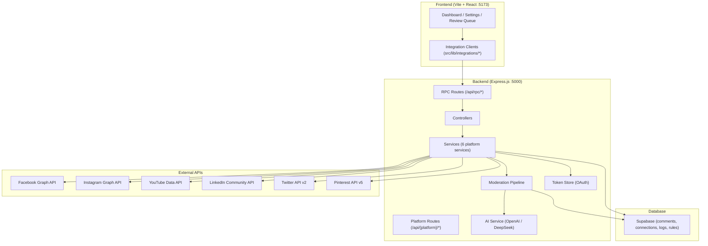

# Product Requirements Document (PRD): Trustlens

> **Version**: 2.0 · **Last Updated**: June 25, 2026

---

## 1. Product Vision

**Trustlens** is an enterprise-grade, AI-driven comment moderation platform that protects creators, brands, and public figures from toxic, abusive, spam, and harmful comments across **6 major social media platforms**. It normalizes comments into a unified schema, runs them through a multilingual AI moderation pipeline, and takes automated actions — all from a single dashboard.

### Core Value Proposition
- **One dashboard** for all social media comment moderation
- **AI-first** — every comment is analyzed for toxicity, sentiment, language, and categories
- **Automated workflows** — set rules, and the system acts on your behalf (delete, hide, block, rewrite)
- **Multilingual** — supports 20+ languages including Tanglish, Hinglish, and mixed-script inputs
- **Audit-ready** — every moderation action is logged for compliance and review

---

## 2. Supported Platforms (Current State ✅)

All 6 platforms are **fully integrated and production-ready**:

| Rank | Platform | Monthly Users | API Used | Status |
|------|----------|--------------|----------|--------|
| 1 | **Facebook** | ~3.1B | Page Graph API v20.0 | ✅ Full (read/write/delete/hide/ban) |
| 2 | **Instagram** | ~3.0B | Instagram Graph API v20.0 | ✅ Full (read/write/delete/hide) |
| 3 | **YouTube** | ~2.5–2.8B | YouTube Data API v3 (OAuth 2.0) | ✅ Full (OAuth flow + read/write/delete/hide/ban) |
| 4 | **LinkedIn** | ~1B+ | Community Management API | ✅ Full (read/write/delete/reply) |
| 5 | **Twitter / X** | ~600M | API v2 (Bearer Token) | ✅ Full (read/delete/bulk) |
| 6 | **Pinterest** | ~550M | API v5 (Bearer Token) | ✅ Read-only (API limitation — no delete/hide) |

### Platform Capabilities Matrix

| Capability | Facebook | Instagram | YouTube | LinkedIn | Twitter/X | Pinterest |
|-----------|----------|-----------|---------|----------|-----------|-----------|
| Fetch comments | ✅ | ✅ | ✅ | ✅ | ✅ | ✅ |
| Delete comments | ✅ | ✅ | ✅ | ✅ | ✅ | ❌ |
| Hide comments | ✅ | ✅ | ✅ | — | — | ❌ |
| Reply to comments | ✅ | ✅ | ✅ | ✅ | — | — |
| Ban/block users | ✅ | — | ✅ | — | — | — |
| Bulk delete | ✅ | ✅ | ✅ | ✅ | ✅ | — |
| AI moderation pipeline | ✅ | ✅ | ✅ | ✅ | ✅ | ✅ |
| Token auto-refresh | ✅ (never-expire) | ❌ (60-day) | ✅ (auto) | ❌ (60-day) | ✅ (never) | ✅ (never) |

---

## 3. System Architecture

### 3.1 Tech Stack

| Layer | Technology |
|-------|-----------|
| **Frontend** | React 19, Vite 7, TypeScript 5.8, Tailwind CSS 4, Radix UI, Framer Motion, Recharts |
| **Backend** | Express.js 5 (Node.js 18+), Axios, Helmet, Morgan, Rate Limiting |
| **Database** | Supabase (PostgreSQL + RLS + Realtime subscriptions) |
| **AI Engine** | OpenAI GPT-4o-mini (primary) / DeepSeek (fallback) |
| **Auth** | Supabase Auth (email/password, role-based access) |
| **Real-time** | Supabase Postgres Changes + WebSocket log streaming |

### 3.2 Architecture Diagram



### 3.3 Database Schema

| Table | Purpose |
|-------|---------|
| `comments` | All ingested comments (unified schema across 6 platforms) |
| `platform_connections` | Connection status, sync cursor, last error, imported count per platform |
| `activity_logs` | Audit trail of all moderation actions |
| `blacklist` | Keywords and user handles blocked by the system |
| `workflow_rules` | Custom automation rules (conditions → actions) |
| `workflow_executions` | Execution log of triggered workflow rules |
| `moderator_feedback` | Human feedback on AI decisions (for training/quality) |
| `research_queries` | AI research query history and results |
| `profiles` | User display names and metadata |
| `user_roles` | Role-based access control (admin/member) |

---

## 4. Feature Inventory

### 4.1 Dashboard & Analytics
- **Real-time dashboard** with live comment stream, toxicity trends, and platform health
- **7-day sentiment chart** (toxic / positive / neutral breakdown by day)
- **Language distribution** visualization
- **Platform health widget** showing connection status across all 6 platforms
- **Stats cards** with total comments, toxic %, blocked users, and active workflows

### 4.2 Comment Management
- **Content Stream** — browse all ingested comments with filters (platform, sentiment, category, status)
- **Review Queue** — AI-flagged comments requiring human decision (approve / delete / block)
- **Negative Feed** — filtered view of negative/toxic comments only
- **Cyberbullying Detection** — dedicated view for cyberbullying-category comments with deep analysis

### 4.3 AI Moderation Pipeline
Every synced comment passes through:
1. **Language Detection** — 20+ languages including Tanglish, Hinglish, mixed-script
2. **Translation** — automatic English translation for non-English comments
3. **Sentiment Analysis** — positive / neutral / negative scoring (0–100)
4. **Toxicity Scoring** — 0–100 scale with configurable thresholds
5. **Category Classification** — safe, toxic, hate, harassment, cyberbullying, threats, spam, scam, sexual, misinformation
6. **Decision Engine** — allow / review / rewrite / delete / block
7. **Rewrite Suggestions** — AI generates a polite alternative for borderline content
8. **Prompt Injection Defense** — comments are sandboxed to prevent AI manipulation

### 4.4 Automated Workflows
- **Custom rules** with configurable conditions (toxicity threshold, keywords, categories, platform)
- **Actions**: auto-delete, auto-hide, auto-block, flag for review, rewrite
- **Execution log** for auditing which rules fired and when
- **Toggle rules** on/off without deleting

### 4.5 Blacklist & Blocking
- **Keyword blacklist** — auto-flag or delete comments matching specific words
- **User handle blacklist** — ban known bad actors across platforms
- **AI-triggered blocks** — users producing repeated severe content are auto-blocked

### 4.6 AI Research Tools
- **User profile research** — AI risk assessment of commenter accounts
- **Toxicity analyzer** — test any text against the AI pipeline
- **Spam detector** — dedicated spam/scam classification
- **Translator** — on-demand multilingual translation tool

### 4.7 Platform Connection Management
- **6-platform settings panel** with test / sync / disconnect controls per platform
- **YouTube OAuth popup flow** for secure channel connection
- **Real-time sync status** with imported count, last sync time, rate limit tracking
- **Background sync** every 15 minutes
- **Unified Sync All** button for cross-platform batch sync

### 4.8 Admin & Auth
- **Supabase Auth** with email/password login
- **Role-based access** — Admin vs Member roles
- **Admin panel** — user management (create / delete / assign roles)
- **Row-Level Security** — users only see their own data (admins see all)

### 4.9 UI/UX
- **Dark mode** interface with premium design aesthetic
- **Responsive layout** — sidebar on desktop, bottom nav on mobile
- **Framer Motion animations** — sidebar rail, page transitions
- **Real-time updates** via Supabase Postgres Changes (no manual refresh needed)
- **Toast notifications** for all sync/test/disconnect actions
- **WebSocket log stream** for real-time backend monitoring

---

## 5. Unified Comment Schema

Every platform's comments are normalized into this shape before storage:

```typescript
interface UnifiedComment {
  external_id: string;      // Platform's native comment ID
  platform: "facebook" | "instagram" | "youtube" | "linkedin" | "twitter" | "pinterest";
  author: string;           // Display name or @username
  text: string;             // Comment body
  created_at: string;       // ISO 8601 timestamp
  post_id?: string;         // Parent post/video/tweet/pin ID
  permalink?: string;       // Direct link to the comment
  language?: string;        // ISO language code
}
```

---

## 6. API Endpoints Summary

### RPC Endpoints (per platform × 3)
For each of the 6 platforms: `test{Platform}Connection`, `sync{Platform}Now`, `disconnect{Platform}`

### Platform-specific REST Endpoints
- `GET /api/{platform}/comments` — fetch comments
- `DELETE /api/{platform}/comments/:id` — delete a specific comment
- `POST /api/{platform}/comments/bulk-delete` — bulk delete

### Shared Endpoints
- `POST /api/rpc/executePlatformActions` — cross-platform action dispatcher
- `POST /api/rpc/analyzeToxic` — AI toxicity analysis
- `POST /api/rpc/translateText` — AI translation
- `POST /api/rpc/detectSpam` — AI spam detection
- `POST /api/rpc/researchUser` — AI user research
- `GET /api/rpc/listWorkflowRules` — workflow rule CRUD
- `GET /api/rpc/listPlatformConnections` — all connection statuses
- `GET /api/dashboard/stats` — dashboard summary stats

---

## 7. Environment Configuration

The system requires the following environment variables (all stored server-side in `.env`):

| Variable Group | Keys | Required |
|---------------|------|----------|
| **Supabase** | `SUPABASE_URL`, `SUPABASE_PUBLISHABLE_KEY`, `VITE_SUPABASE_URL`, `VITE_SUPABASE_PUBLISHABLE_KEY` | ✅ |
| **Backend Auth** | `API_AUTH_TOKEN` | ✅ |
| **AI Provider** | `OPENAI_API_KEY` or `DEEPSEEK_API_KEY` (at least one) | ✅ |
| **YouTube** | `YOUTUBE_OAUTH_CLIENT_ID`, `YOUTUBE_OAUTH_CLIENT_SECRET`, `YOUTUBE_OAUTH_REDIRECT_URI` | Per platform |
| **Instagram** | `INSTAGRAM_ACCESS_TOKEN`, `INSTAGRAM_ACCOUNT_ID` | Per platform |
| **Facebook** | `FACEBOOK_PAGE_ACCESS_TOKEN`, `FACEBOOK_PAGE_ID` | Per platform |
| **Twitter/X** | `TWITTER_BEARER_TOKEN`, `TWITTER_USER_ID` | Per platform |
| **LinkedIn** | `LINKEDIN_ACCESS_TOKEN`, `LINKEDIN_ORGANIZATION_ID` | Per platform |
| **Pinterest** | `PINTEREST_ACCESS_TOKEN` | Per platform |

---

## 8. Future Roadmap

### Phase 3 (Next)
- **Webhook-based real-time sync** — push notifications from platforms instead of polling
- **Advanced Custom Workflows** — more granular trigger conditions and actions
- **Enhanced Analytics** — deeper insights into toxicity trends and community health

### Phase 4 (Future)
- **Custom AI model training** — fine-tune on moderator feedback data
- **Multi-tenant SaaS** — white-label deployment for agencies and enterprises
- **Mobile app** — dedicated iOS/Android companion for on-the-go moderation
